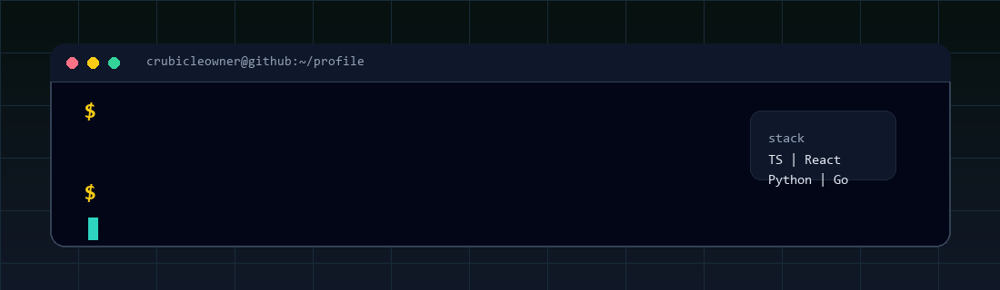

<div align="center">
  
</div>

<br />

<div align="center">
  <a href="https://github.com/crubicleowner?tab=repositories">
    
  </a>
  
  
</div>

## About

I build practical AI-powered tools, automation systems, desktop/web apps, and infrastructure experiments.

My favorite kind of project is the one that turns a messy workflow into something visible, testable, and useful: a cockpit, a pipeline, a dashboard, a small service, or an agent loop that actually helps ship work.

```text
current_mode = {
  building: ["AI-assisted workflows", "desktop tools", "automation pipelines"],
  exploring: ["agent systems", "infra tooling", "developer experience"],
  preference: "small useful systems over loud demos"
}
```

## Current Focus

- Building AI-assisted development and research workflows.
- Turning raw inputs into structured outputs, reports, dashboards, and decisions.
- Working across desktop apps, web dashboards, backend services, and infrastructure.
- Keeping experiments practical: clear contracts, visible state, and repeatable runs.

## Featured Work

<table>
  <tr>
    <td width="50%">
      <h3>BulAI2</h3>
      <p>Desktop-first engineering cockpit for research -> CAD/mesh -> CFD/OpenFOAM -> validation -> report workflows.</p>
      <p><strong>Stack:</strong> TypeScript, React, Electron, Vite, agent workflow contracts</p>
      <p><a href="https://github.com/crubicleowner/bulbai2">View repository</a></p>
    </td>
    <td width="50%">
      <h3>Konspektum</h3>
      <p>Pipeline for turning lecture audio or transcripts into structured study packs: JSON, Markdown, Anki TSV, and DOCX.</p>
      <p><strong>Stack:</strong> TypeScript, Node.js, document generation, AI providers</p>
    </td>
  </tr>
  <tr>
    <td width="50%">
      <h3>OneTouchVPN / VPN Tooling</h3>
      <p>VPN-oriented API, client, and automation experiments with a focus on operational clarity and simple user flows.</p>
      <p><strong>Stack:</strong> Go, networking, desktop clients, service automation</p>
      <p><a href="https://github.com/crubicleowner/onetouchvpn">View repository</a></p>
    </td>
    <td width="50%">
      <h3>Automation and OSINT Tools</h3>
      <p>Python dashboards and scanners for collecting signals, structuring data, and making noisy inputs easier to inspect.</p>
      <p><strong>Stack:</strong> Python, FastAPI, Flask, async workers, reporting</p>
    </td>
  </tr>
</table>

## Toolbox

<div align="center">


</div>

## How I Build

- Start with a working vertical slice.
- Keep state visible and artifacts reviewable.
- Prefer small contracts between tools, agents, and services.
- Use automation where it reduces repeated human work.
- Leave enough structure that the next run is easier than the first one.

## GitHub Activity

<div align="center">
  
  
</div>

## Collaboration

Open to building useful tools, experiments, and automation workflows.

If a project needs a practical system that connects research, code, data, and UI, that is the kind of problem I like.
