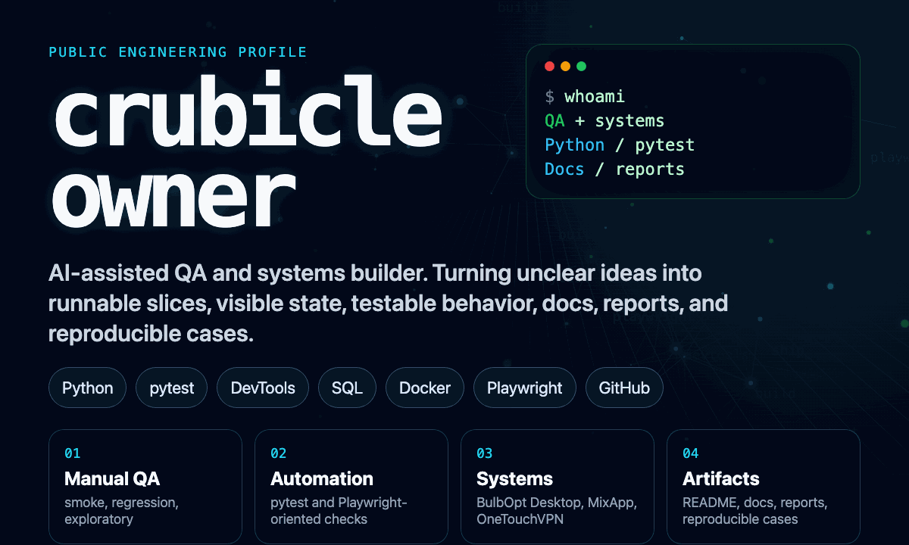

<div align="center">
  
</div>

## Applied systems over demo theater

I build tools that make messy work legible: AI-assisted pipelines, automation loops, desktop cockpits, backend services, and infrastructure utilities.

The pattern I keep returning to is simple: noisy inputs become visible state, visible state becomes reviewable artifacts, and the next run gets easier than the last one.

### Selected systems

| System | Shape | Notes |
| --- | --- | --- |
| [BulAI2](https://github.com/crubicleowner/bulbai2) | Engineering workflow cockpit | Research -> geometry/CAD -> mesh/simulation readiness -> validation/reporting. Desktop-first, artifact-driven, agent-friendly. |
| Konspektum | Lecture-to-study pipeline | Turns raw lecture audio or transcripts into structured study outputs: Markdown, JSON, Anki TSV, DOCX. |
| [OneTouchVPN](https://github.com/crubicleowner/onetouchvpn) | VPN and service tooling | API/client/infrastructure experiments around networking, operational clarity, and user-facing setup flows. |
| Signal tools | Dashboards and scanners | Python utilities for collecting signals, structuring data, and making noisy inputs easier to inspect. |

### Working range

```txt
interfaces     React / Electron / Vite / compact operational UI
automation     Python / TypeScript / async workers / reporting
services       FastAPI / Flask / Node / Go
systems        Docker / GitHub workflows / local-first tooling
ai             agent workflows / provider integrations / structured outputs
```

### Build bias

- Start with a vertical slice that can actually run.
- Make state visible before making the system clever.
- Keep artifacts inspectable and handoffs explicit.
- Use agents and automation where they remove real repeated work.
- Prefer quiet tools that survive contact with reality.

### Current interests

Applied AI workflows, desktop control surfaces, automation infrastructure, and small systems that connect research, code, data, and UI without turning into a circus.
