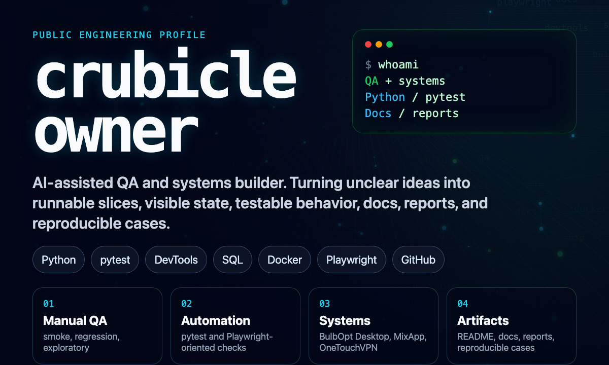

<div align="center">
  
</div>

## Readable Systems. Testable Behavior. Useful Artifacts.

I build AI-assisted tools, QA workflows, desktop control surfaces, and web systems with a practical bias: make the state visible, make behavior testable, and leave behind artifacts that another person can inspect.

My work is strongest where product thinking, code, documentation, and verification meet: turning unclear ideas into runnable slices, then tightening them through manual checks, test scenarios, reports, and iteration.

### Selected Systems

| System | Shape | Evidence |
| --- | --- | --- |
| [BulbOpt Desktop](https://github.com/crubicleowner/bulbai2) | Engineering workflow cockpit | Python project structure, pytest checks, docs, local worker concepts, report-oriented vertical slice. |
| MixApp | Full-cycle digital/web project | Web presence, offer structure, content packaging, manual UI checks, DevTools-driven review. |
| [OneTouchVPN](https://github.com/crubicleowner/onetouchvpn) | VPN/service tooling prototype | User-facing setup flow, interface prototype, networking/service-oriented experiments. |
| Signal tools | Data and automation utilities | Small Python workflows for collecting, shaping, and inspecting noisy inputs. |

### Proof Of Work

- **Testing mindset:** functional checks, smoke/regression flows, exploratory review, reproducible cases, bug-report thinking.
- **Technical QA range:** DevTools, SQL basics, Docker exposure, Playwright-oriented scenarios, pytest-based checks.
- **Artifact discipline:** README files, project docs, setup notes, test outputs, reports, and clear handoff material.
- **AI-assisted delivery:** AI is used for acceleration, but the output is reviewed, debugged, structured, and owned.

### Working Range

```txt
qa              manual testing / smoke / regression / exploratory / bug reports
automation      Python / pytest / Playwright-oriented scenarios / repeatable checks
interfaces      HTML / CSS / Flutter exposure / compact product UI
systems         Git / GitHub / Docker exposure / local-first workflows
data            SQL basics / JSON / HTTP concepts / reportable state
ai              prompt -> build -> verify -> improve
```

### Operating Principles

- Start with a vertical slice that can actually run.
- Make state visible before making the system clever.
- Treat docs, reports, and reproducible cases as part of the product.
- Use AI where it removes repeated work, then verify the result like an engineer.
- Prefer small systems that are easy to inspect, explain, and improve.
